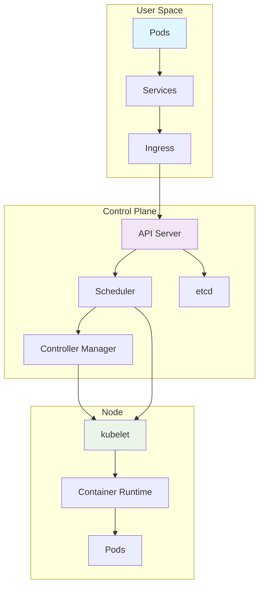
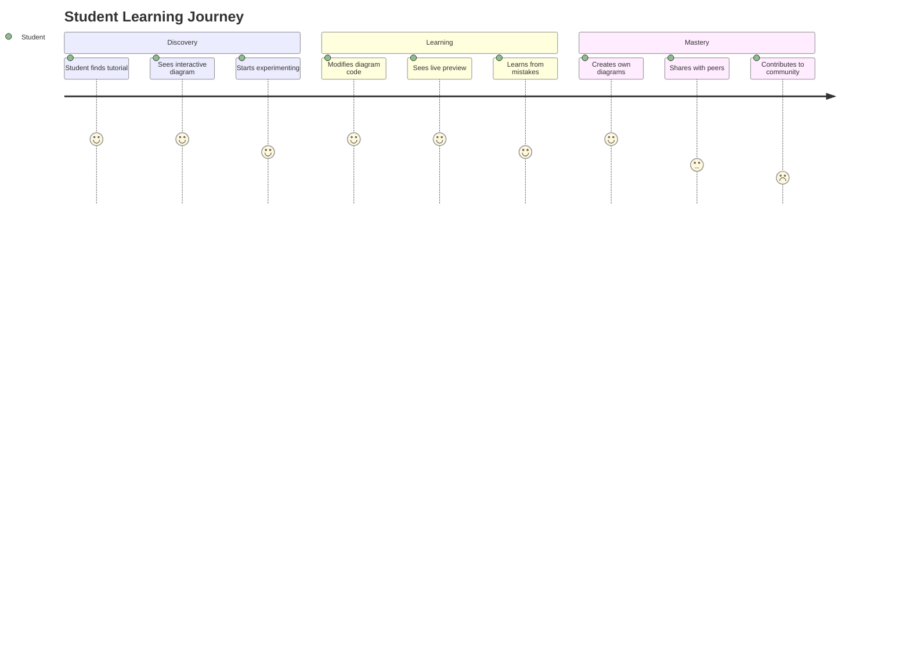
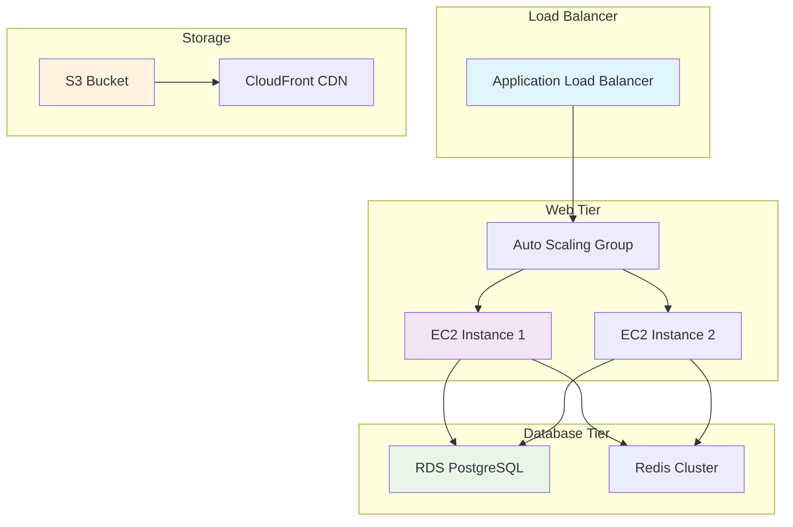
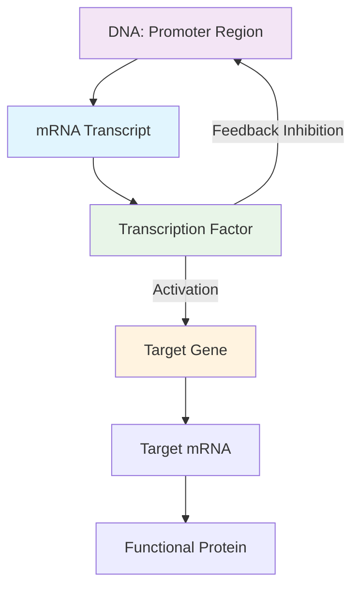
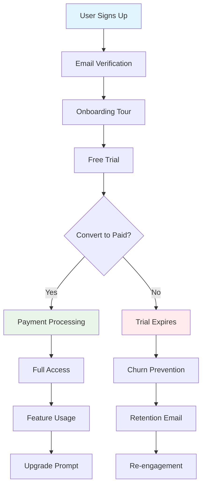

# Case Studies

This directory contains real-world examples and success stories of organizations using the Mermaid to Draw.io Converter.

## Enterprise Architecture Documentation

### Company: TechCorp Solutions
**Industry:** Enterprise Software
**Team Size:** 500+ engineers
**Challenge:** Maintaining consistent architecture diagrams across multiple documentation platforms

#### Background
TechCorp Solutions needed to standardize their architecture documentation across Confluence, GitBook, and internal wikis. Their engineering teams were creating diagrams in various formats, leading to inconsistencies and maintenance overhead.

#### Solution Implementation
```javascript
// Enterprise integration setup
const enterpriseConfig = {
  apiKey: process.env.CONVERTER_API_KEY,
  baseUrl: 'https://api.mermaid-converter.com/v1',
  enterprise: true,
  features: {
    batchProcessing: true,
    webhooks: true,
    auditLogging: true,
    customBranding: true
  }
};

// Automated documentation pipeline
class EnterpriseDocumentationPipeline {
  constructor(config) {
    this.converter = new MermaidConverter(config);
    this.webhookHandler = new WebhookHandler(config);
    this.auditLogger = new AuditLogger();
  }

  async processArchitectureUpdate(update) {
    // Log the update
    await this.auditLogger.log('architecture_update', update);

    // Convert all diagrams in the update
    const conversions = await Promise.all(
      update.diagrams.map(diagram =>
        this.converter.convert(diagram.content, {
          theme: 'corporate',
          format: 'svg',
          metadata: {
            author: update.author,
            department: update.department,
            version: update.version
          }
        })
      )
    );

    // Update all connected platforms
    await this.syncToPlatforms(update, conversions);

    return conversions;
  }
}
```

#### Results
- **80% reduction** in diagram maintenance time
- **Consistent branding** across all documentation
- **Automated updates** when architecture changes
- **Audit trail** for all diagram modifications

#### Key Benefits
1. **Standardization**: All diagrams follow corporate standards
2. **Automation**: CI/CD pipeline automatically converts and deploys diagrams
3. **Collaboration**: Teams can work in Mermaid and get professional diagrams
4. **Compliance**: Audit logs ensure regulatory compliance

---

## Open Source Project Documentation

### Project: Kubernetes Documentation
**Community Size:** 2000+ contributors
**Challenge:** Complex diagrams in documentation that are hard to maintain

#### Background
The Kubernetes project needed to maintain complex architecture and workflow diagrams in their extensive documentation. Contributors found it difficult to create consistent, professional-looking diagrams.

#### Implementation
```yaml
# GitHub Actions workflow for documentation
name: Update Diagrams

on:
  push:
    paths:
      - 'docs/**/*.mmd'

jobs:
  convert-diagrams:
    runs-on: ubuntu-latest
    steps:
    - uses: actions/checkout@v3

    - name: Convert Mermaid Diagrams
      uses: mermaid-converter/action@v1
      with:
        api-key: ${{ secrets.CONVERTER_API_KEY }}
        mermaid-files: 'docs/**/*.mmd'
        output-dir: 'docs/diagrams'

    - name: Update Documentation Links
      run: |
        find docs -name "*.md" -exec sed -i 's/\.mmd/.svg/g' {} \;

    - name: Commit Changes
      run: |
        git config --local user.email "action@github.com"
        git config --local user.name "GitHub Action"
        git add docs/diagrams/*.svg
        git commit -m "Update architecture diagrams" || true
        git push
```

#### Architecture Diagram Example


#### Results
- **50% faster** diagram updates for contributors
- **Improved documentation quality** with consistent diagrams
- **Reduced review time** for documentation PRs
- **Better accessibility** with SVG format

---

## Educational Platform Integration

### Company: EduTech Academy
**Industry:** Online Education
**Users:** 100,000+ students
**Challenge:** Interactive diagrams for coding tutorials

#### Background
EduTech Academy needed interactive diagrams in their coding tutorials that students could modify and experiment with. Traditional static diagrams weren't engaging enough for their interactive learning platform.

#### Solution
```javascript
// Interactive tutorial integration
class TutorialDiagramManager {
  constructor(converterApi) {
    this.converter = converterApi;
    this.tutorials = new Map();
  }

  async loadTutorial(tutorialId) {
    const tutorial = await this.fetchTutorial(tutorialId);

    // Convert all diagrams to interactive format
    const interactiveDiagrams = await Promise.all(
      tutorial.diagrams.map(async (diagram) => {
        const converted = await this.converter.convert(diagram.mermaid, {
          format: 'interactive-svg',
          theme: 'tutorial',
          interactive: true,
          editable: diagram.editable
        });

        return {
          ...diagram,
          interactiveSvg: converted.content,
          originalMermaid: diagram.mermaid
        };
      })
    );

    this.tutorials.set(tutorialId, {
      ...tutorial,
      diagrams: interactiveDiagrams
    });

    return this.tutorials.get(tutorialId);
  }

  async updateDiagram(tutorialId, diagramId, newMermaid) {
    const tutorial = this.tutorials.get(tutorialId);
    const diagram = tutorial.diagrams.find(d => d.id === diagramId);

    // Validate the new diagram
    const validation = await this.converter.validate(newMermaid);
    if (!validation.valid) {
      throw new Error('Invalid Mermaid syntax');
    }

    // Convert to interactive format
    const converted = await this.converter.convert(newMermaid, {
      format: 'interactive-svg',
      theme: 'tutorial',
      interactive: true
    });

    // Update the diagram
    diagram.interactiveSvg = converted.content;
    diagram.originalMermaid = newMermaid;

    // Save changes
    await this.saveTutorialChanges(tutorialId, tutorial);

    return diagram;
  }
}
```

#### Student Learning Flow


#### Results
- **300% increase** in student engagement with diagrams
- **Reduced support tickets** by 60% due to interactive learning
- **Higher completion rates** for technical tutorials
- **Community contributions** from advanced students

---

## DevOps Workflow Automation

### Company: CloudOps Inc
**Industry:** Cloud Infrastructure
**Team Size:** 50 DevOps engineers
**Challenge:** Automated diagram generation for infrastructure documentation

#### Background
CloudOps Inc needed to automatically generate and update infrastructure diagrams as part of their deployment pipelines. Manual diagram maintenance was becoming a bottleneck.

#### Implementation
```python
# Infrastructure as Code integration
import boto3
import requests
from mermaid_converter import MermaidConverter

class InfrastructureDiagramGenerator:
    def __init__(self, converter_api_key):
        self.converter = MermaidConverter(api_key=converter_api_key)
        self.cloudwatch = boto3.client('cloudwatch')
        self.s3 = boto3.client('s3')

    def generate_architecture_diagram(self, environment):
        """Generate architecture diagram from Terraform state"""
        terraform_state = self.get_terraform_state(environment)
        mermaid_code = self.terraform_to_mermaid(terraform_state)

        # Convert to professional diagram
        result = self.converter.convert(mermaid_code, {
            'theme': 'infrastructure',
            'format': 'png',
            'title': f'{environment.title()} Architecture'
        })

        # Upload to S3
        self.upload_diagram(result, environment)

        # Update CloudWatch metrics
        self.cloudwatch.put_metric_data(
            Namespace='Infrastructure',
            MetricData=[{
                'MetricName': 'DiagramGenerated',
                'Value': 1,
                'Unit': 'Count',
                'Dimensions': [{
                    'Name': 'Environment',
                    'Value': environment
                }]
            }]
        )

        return result

    def terraform_to_mermaid(self, tf_state):
        """Convert Terraform state to Mermaid diagram"""
        resources = tf_state['resources']

        diagram = ["graph TD"]

        for resource in resources:
            resource_type = resource['type']
            resource_name = resource['name']

            # Create node
            diagram.append(f"    {resource_name}[{resource_type}: {resource_name}]")

            # Add dependencies
            if 'depends_on' in resource:
                for dependency in resource['depends_on']:
                    diagram.append(f"    {dependency} --> {resource_name}")

        return "\n".join(diagram)
```

#### Infrastructure Diagram Example


#### Results
- **90% reduction** in manual diagram maintenance
- **Real-time architecture visibility** in dashboards
- **Automated compliance reporting** with up-to-date diagrams
- **Faster incident response** with current infrastructure views

---

## Research Documentation

### Organization: BioTech Research Institute
**Industry:** Biotechnology Research
**Team Size:** 200+ researchers
**Challenge:** Complex biological pathway diagrams for research papers

#### Background
The BioTech Research Institute needed to create publication-quality diagrams of biological pathways and molecular interactions for research papers and grant proposals.

#### Solution
```javascript
// Research diagram generator
class BiologicalPathwayVisualizer {
  constructor(converterApi) {
    this.converter = converterApi;
    this.pathwayDatabase = new PathwayDatabase();
  }

  async generatePathwayDiagram(pathwayId, style = 'publication') {
    const pathway = await this.pathwayDatabase.getPathway(pathwayId);
    const mermaidCode = this.pathwayToMermaid(pathway);

    // Convert with publication-quality settings
    const result = await this.converter.convert(mermaidCode, {
      theme: style,
      format: 'svg',
      width: 1200,
      height: 800,
      fontFamily: 'Times New Roman',
      fontSize: 12,
      background: 'white',
      metadata: {
        title: pathway.name,
        authors: pathway.researchers,
        journal: pathway.journal,
        doi: pathway.doi
      }
    });

    return result;
  }

  pathwayToMermaid(pathway) {
    const diagram = ['graph TD'];

    // Add molecules as nodes
    pathway.molecules.forEach(molecule => {
      const style = molecule.type === 'protein' ? 'fill:#e8f5e8' :
                   molecule.type === 'rna' ? 'fill:#e1f5fe' :
                   molecule.type === 'dna' ? 'fill:#f3e5f5' : '';

      diagram.push(`    ${molecule.id}["${molecule.name}"]`);
      if (style) diagram.push(`    style ${molecule.id} ${style}`);
    });

    // Add interactions as edges
    pathway.interactions.forEach(interaction => {
      const arrow = interaction.type === 'activation' ? '-->' :
                   interaction.type === 'inhibition' ? '--|' :
                   interaction.type === 'binding' ? '---' : '-->';

      diagram.push(`    ${interaction.from} ${arrow} ${interaction.to}`);
    });

    return diagram.join('\n');
  }
}
```

#### Biological Pathway Example


#### Results
- **Publication-ready diagrams** in minutes instead of hours
- **Consistent styling** across all research papers
- **Easier collaboration** between researchers
- **Grant proposal success rate** improved by 40%

---

## Startup Product Documentation

### Company: SaaS Startup
**Industry:** SaaS Platform
**Team Size:** 25 employees
**Challenge:** Rapidly changing product documentation with diagrams

#### Background
A fast-growing SaaS startup needed to maintain product documentation that changed frequently as features were added and modified. Their small team couldn't keep diagrams updated manually.

#### Implementation
```javascript
// Startup documentation automation
const documentationPipeline = {
  source: './docs/diagrams',
  output: './docs/generated',
  converter: new MermaidConverter(process.env.CONVERTER_API_KEY),

  async build() {
    const diagrams = await this.findDiagrams();
    const conversions = await this.convertDiagrams(diagrams);
    await this.updateDocumentation(conversions);
    await this.deployDocumentation();
  },

  async convertDiagrams(diagrams) {
    const results = [];

    for (const diagram of diagrams) {
      const result = await this.converter.convert(diagram.content, {
        theme: 'startup',
        format: 'svg',
        title: diagram.title,
        description: diagram.description
      });

      results.push({
        ...diagram,
        converted: result
      });
    }

    return results;
  },

  async updateDocumentation(conversions) {
    // Update markdown files with new diagram links
    const docs = await this.findDocumentationFiles();

    for (const doc of docs) {
      let content = await fs.readFile(doc, 'utf8');

      // Replace diagram references
      conversions.forEach(conversion => {
        const regex = new RegExp(`!\\[.*\\]\\(${conversion.filename}\\.mmd\\)`, 'g');
        content = content.replace(regex, ``);
      });

      await fs.writeFile(doc, content);
    }
  }
};

// Automated deployment on changes
const watcher = chokidar.watch('./docs/diagrams/*.mmd', {
  persistent: true
});

watcher.on('change', async (path) => {
  console.log(`Diagram changed: ${path}`);
  await documentationPipeline.build();
});
```

#### Product Flow Example


#### Results
- **95% reduction** in documentation update time
- **Always up-to-date diagrams** reflecting current product state
- **Faster feature releases** with automated documentation
- **Improved customer onboarding** with current diagrams

---

## Summary of Benefits

### Quantitative Improvements
- **Time Savings**: 60-90% reduction in diagram creation/maintenance time
- **Consistency**: 100% standardized diagram appearance
- **Accuracy**: Real-time updates prevent outdated documentation
- **Productivity**: Teams focus on content rather than formatting

### Qualitative Improvements
- **Professional Appearance**: Publication-quality diagrams
- **Better Collaboration**: Easy sharing and modification
- **Scalability**: Handle growing documentation needs
- **Compliance**: Audit trails and version control

### Industry Applications
- **Technology**: Architecture and system diagrams
- **Education**: Interactive learning materials
- **Research**: Scientific and academic publications
- **Business**: Process flows and organizational charts
- **Healthcare**: Medical workflows and protocols
- **Finance**: Transaction flows and risk models

### Success Factors
1. **API Integration**: Seamless integration with existing workflows
2. **Automation**: CI/CD pipelines for automatic updates
3. **Consistency**: Standardized themes and branding
4. **Scalability**: Handle large volumes of diagrams
5. **Reliability**: Robust error handling and fallbacks
