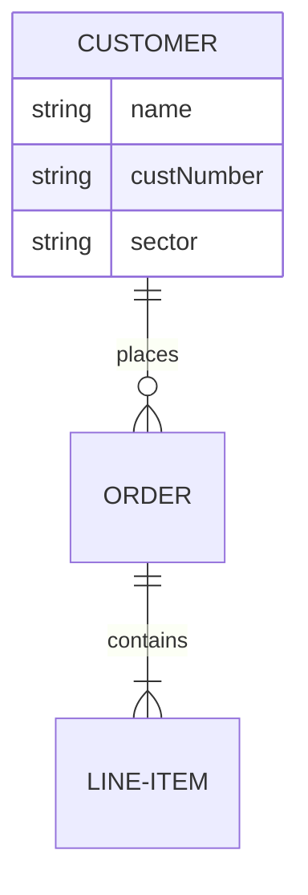

# Development Guide

This guide is for developers who want to contribute to or extend the Mermaid to Draw.io converter.

## Development Setup

### Prerequisites

- Node.js 16+
- npm 7+
- Git
- Code editor (VS Code recommended)

### Clone and Setup

```bash
git clone https://github.com/yourusername/mermaid-to-drawio.git
cd mermaid-to-drawio
npm install
npx playwright install
```

### Development Scripts

```bash
# Run tests
npm test

# Run linting
npm run lint

# Format code
npm run format

# Build for production
npm run build

# Start development server
npm run dev
```

## Project Structure

```
├── converter.js              # Main entry point
├── *-converter.js           # Diagram-specific converters
├── package.json             # Project configuration
├── Assets/                  # Supporting documents
├── Docs/                    # Documentation
├── Guidelines/              # Usage guidelines
├── Templates/               # Diagram templates
├── src/                     # Source code
│   ├── core/               # Core functionality
│   ├── converters/         # Converter modules
│   ├── utils/              # Utility functions
│   └── types/              # TypeScript definitions
├── tests/                   # Test files
│   ├── unit/               # Unit tests
│   ├── integration/        # Integration tests
│   └── fixtures/           # Test data
└── docs/                    # Generated documentation
```

## Architecture Overview

### Core Components

#### Converter Engine
The main conversion engine handles:
- Input parsing
- Browser automation
- Output generation
- Error handling

#### Diagram Converters
Each diagram type has a dedicated converter:
- Extends base `Converter` class
- Implements `convert()` method
- Handles type-specific logic

#### Browser Manager
Manages Playwright browser instances:
- Launches browsers
- Handles page lifecycle
- Manages resources

### Design Patterns

#### Strategy Pattern
Different converters implement the same interface:

```javascript
class BaseConverter {
  async convert(input) {
    // Common conversion logic
  }
}

class FlowchartConverter extends BaseConverter {
  async convert(input) {
    // Flowchart-specific logic
    return super.convert(input);
  }
}
```

#### Factory Pattern
Converter factory creates appropriate converter:

```javascript
class ConverterFactory {
  static create(type) {
    switch (type) {
      case 'flowchart':
        return new FlowchartConverter();
      case 'gantt':
        return new GanttConverter();
      // ...
    }
  }
}
```

## Adding New Diagram Types

### 1. Create Converter Module

Create a new converter file:

```javascript
// erdiagram-converter.js
const BaseConverter = require('./base-converter');

class ErDiagramConverter extends BaseConverter {
  async convert(mermaidCode) {
    // Parse ER diagram syntax
    const elements = this.parseErDiagram(mermaidCode);

    // Convert to Draw.io format
    const drawioXml = this.generateDrawioXml(elements);

    return drawioXml;
  }

  parseErDiagram(code) {
    // ER diagram parsing logic
  }

  generateDrawioXml(elements) {
    // XML generation logic
  }
}

module.exports = ErDiagramConverter;
```

### 2. Register Converter

Add to main converter:

```javascript
// converter.js
const converters = {
  flowchart: require('./flowchart-converter'),
  gantt: require('./gantt-converter'),
  // Add new converter
  erdiagram: require('./erdiagram-converter'),
};
```

### 3. Add Template

Create template file in `Templates/`:



### 4. Update Documentation

Add to relevant docs:
- Update EXAMPLES.md
- Add guidelines in Guidelines/
- Update README.md

## Testing

### Unit Tests

```javascript
// tests/unit/flowchart-converter.test.js
const FlowchartConverter = require('../../flowchart-converter');

describe('FlowchartConverter', () => {
  test('converts simple flowchart', async () => {
    const converter = new FlowchartConverter();
    const input = 'graph TD; A-->B;';
    const result = await converter.convert(input);

    expect(result).toContain('<mxGraphModel>');
    expect(result).toContain('drawio');
  });
});
```

### Integration Tests

```javascript
// tests/integration/full-conversion.test.js
describe('Full Conversion', () => {
  test('converts complex diagram', async () => {
    const input = fs.readFileSync('test-diagram.mmd', 'utf8');
    const output = await convert(input);

    expect(isValidDrawio(output)).toBe(true);
  });
});
```

### Running Tests

```bash
# Run all tests
npm test

# Run specific test file
npm test flowchart-converter.test.js

# Run with coverage
npm run test:coverage

# Run integration tests
npm run test:integration
```

## Code Quality

### Linting

```bash
# Check code style
npm run lint

# Fix auto-fixable issues
npm run lint:fix
```

### Formatting

```bash
# Format code
npm run format

# Check formatting
npm run format:check
```

### Pre-commit Hooks

The project uses Husky for pre-commit hooks:

```bash
# Install hooks
npm run prepare

# Manual pre-commit check
npm run pre-commit
```

## Performance Optimization

### Profiling

```javascript
// Add performance monitoring
const startTime = performance.now();

const result = await converter.convert(input);

const endTime = performance.now();
console.log(`Conversion took ${endTime - startTime} milliseconds`);
```

### Memory Management

```javascript
// Clean up browser instances
class BrowserManager {
  async cleanup() {
    if (this.browser) {
      await this.browser.close();
    }
  }
}
```

### Caching

```javascript
// Cache compiled templates
class TemplateCache {
  constructor() {
    this.cache = new Map();
  }

  get(key) {
    return this.cache.get(key);
  }

  set(key, value) {
    this.cache.set(key, value);
  }
}
```

## Debugging

### Debug Mode

```bash
# Enable debug logging
DEBUG=* node converter.js input.mmd output.drawio

# Debug specific module
DEBUG=converter:* node converter.js input.mmd output.drawio
```

### Browser DevTools

```javascript
// Launch browser with DevTools
const browser = await playwright.chromium.launch({
  headless: false,
  devtools: true
});
```

### Logging

```javascript
// Structured logging
const logger = require('./logger');

logger.info('Starting conversion', { input: 'diagram.mmd' });
logger.error('Conversion failed', { error: err.message });
```

## Contributing

### Pull Request Process

1. Fork the repository
2. Create a feature branch
3. Make changes
4. Add tests
5. Update documentation
6. Submit PR

### Code Review Checklist

- [ ] Tests pass
- [ ] Code linted
- [ ] Documentation updated
- [ ] Performance checked
- [ ] Security reviewed

### Commit Messages

```bash
# Good commit message
feat: add support for ER diagrams

- Add ER diagram converter
- Add ER diagram template
- Update documentation
- Add tests

# Bad commit message
fixed bug
```

## Deployment

### Building

```bash
# Build for production
npm run build

# Create distribution package
npm run dist
```

### Publishing

```bash
# Publish to npm
npm publish

# Create GitHub release
git tag v1.1.0
git push --tags
```

## Security Considerations

### Input Validation

```javascript
// Validate input before processing
function validateInput(input) {
  if (typeof input !== 'string') {
    throw new Error('Input must be a string');
  }

  if (input.length > MAX_INPUT_SIZE) {
    throw new Error('Input too large');
  }

  // Check for malicious content
  if (containsMaliciousCode(input)) {
    throw new Error('Invalid input');
  }
}
```

### Sandboxing

```javascript
// Run conversion in isolated context
const context = await page.context();
await context.addInitScript(() => {
  // Sandbox setup
});
```

## Troubleshooting Development

### Common Issues

#### Module Resolution
```bash
# Clear node_modules and reinstall
rm -rf node_modules package-lock.json
npm install
```

#### Browser Issues
```bash
# Reinstall browsers
npx playwright install --force
```

#### Test Failures
```bash
# Run tests with verbose output
npm test -- --verbose

# Debug specific test
npm test -- --grep "specific test name"
```

## Resources

### Documentation
- [Mermaid Documentation](https://mermaid.js.org/)
- [Draw.io Documentation](https://www.diagrams.net/doc/)
- [Playwright Documentation](https://playwright.dev/)

### Tools
- [ESLint](https://eslint.org/) - Code linting
- [Prettier](https://prettier.io/) - Code formatting
- [Jest](https://jestjs.io/) - Testing framework
- [Husky](https://typicode.github.io/husky/) - Git hooks

### Community
- [GitHub Issues](https://github.com/yourusername/mermaid-to-drawio/issues)
- [Discussions](https://github.com/yourusername/mermaid-to-drawio/discussions)
- [Contributing Guide](../Assets/CONTRIBUTING.md)
