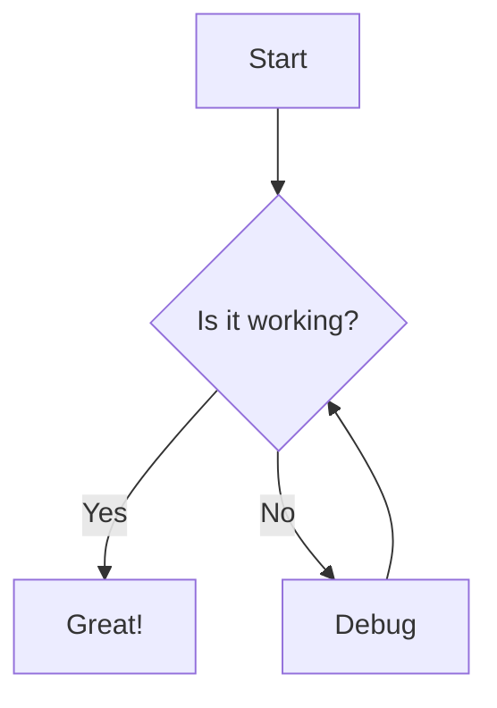
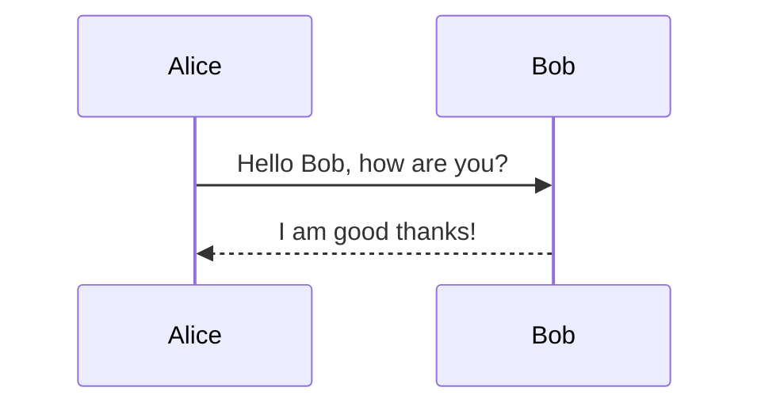
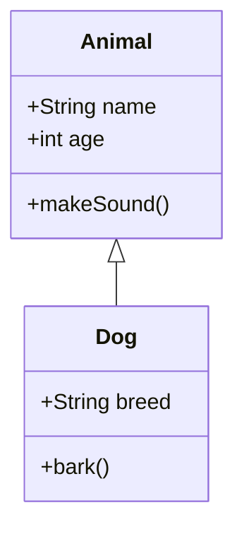
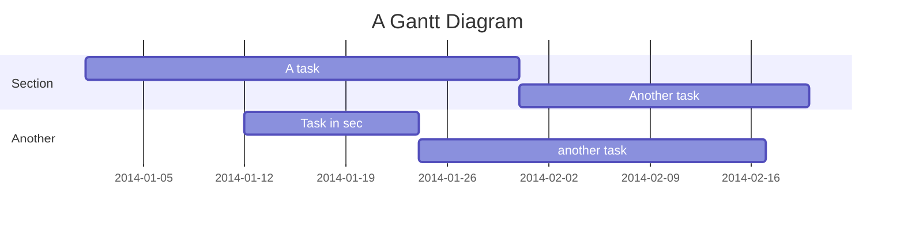
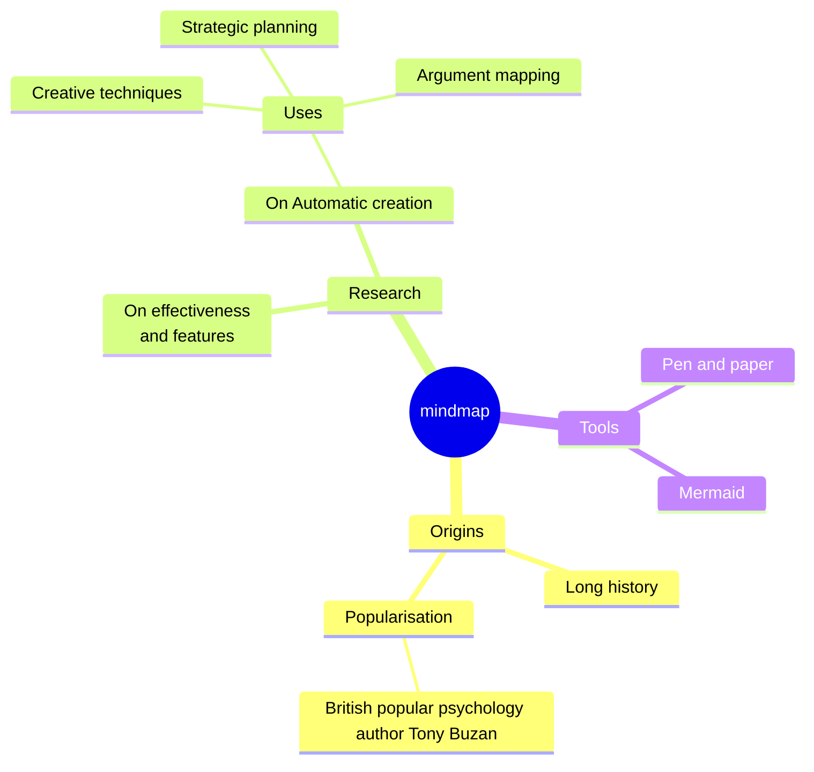
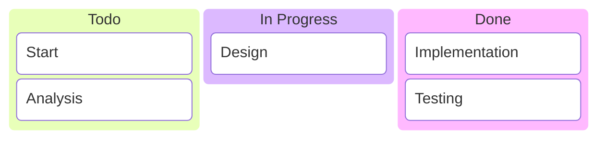
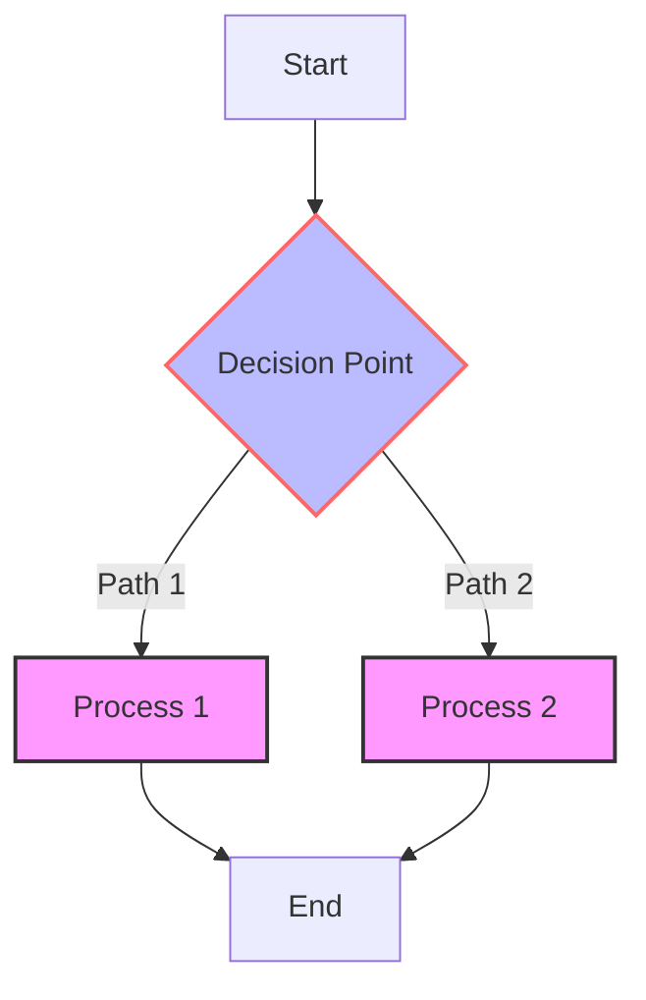
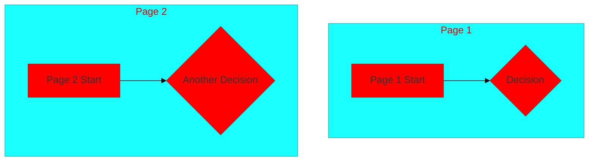

# Examples

This folder contains practical examples demonstrating the Mermaid to Draw.io converter in action. Each example includes source Mermaid diagrams, converted Draw.io XML files, and usage instructions.

## Table of Contents

- [Quick Start Examples](#quick-start-examples)
- [Diagram Type Examples](#diagram-type-examples)
- [Advanced Examples](#advanced-examples)
- [Integration Examples](#integration-examples)
- [Troubleshooting Examples](#troubleshooting-examples)
- [Contributing Examples](#contributing-examples)

## Quick Start Examples

### Basic Flowchart Conversion

**Source: `basic-flowchart.mmd`**


**Converted: `basic-flowchart.drawio.xml`**
```xml
<?xml version="1.0" encoding="UTF-8"?>
<mxfile host="Electron" modified="2024-01-15T10:30:00.000Z" agent="5.0 (Macintosh; Intel Mac OS X 10_15_7) AppleWebKit/537.36 (KHTML, like Gecko) Chrome/91.0.4472.124 Safari/537.36" etag="..." version="15.8.7" type="device">
  <diagram id="..." name="Page-1">
    <mxGraphModel dx="..." dy="..." grid="1" gridSize="10" guides="1" tooltips="1" connect="1" arrows="1" fold="1" page="1" pageScale="1" pageWidth="850" pageHeight="1100" math="0" shadow="0">
      <root>
        <mxCell id="0"/>
        <mxCell id="1" parent="0"/>
        <!-- Converted elements -->
      </root>
    </mxGraphModel>
  </diagram>
</mxfile>
```

**Usage:**
```bash
node converter.js basic-flowchart.mmd basic-flowchart.drawio
```

## Diagram Type Examples

### Sequence Diagram

**Source: `sequence-example.mmd`**


**Converted: `sequence-example.drawio.xml`**
[Full Draw.io XML output would be here]

### Class Diagram

**Source: `class-example.mmd`**


### Gantt Chart

**Source: `gantt-example.mmd`**


### Mind Map

**Source: `mindmap-example.mmd`**


### Kanban Board

**Source: `kanban-example.mmd`**


## Advanced Examples

### Complex Flowchart with Styling

**Source: `complex-flowchart.mmd`**


### Multi-page Diagram

**Source: `multi-page-example.mmd`**


## Integration Examples

### API Integration

**Node.js API Usage:**
```javascript
const converter = require('./converter');

app.post('/convert', async (req, res) => {
    try {
        const { mermaidCode } = req.body;
        const drawioXml = await converter.convert(mermaidCode);
        res.json({ success: true, data: drawioXml });
    } catch (error) {
        res.status(500).json({ success: false, error: error.message });
    }
});
```

### Batch Processing

**Bash Script Example:**
```bash
#!/bin/bash
# batch-convert-examples.sh

for file in examples/*.mmd; do
    output="${file%.mmd}.drawio"
    node converter.js "$file" "$output"
    echo "Converted $file to $output"
done
```

### Docker Integration

**Dockerfile Example:**
```dockerfile
FROM node:16-alpine
WORKDIR /app
COPY package*.json ./
RUN npm install
COPY . .
EXPOSE 3000
CMD ["node", "server.js"]
```

## Troubleshooting Examples

### Common Issues and Solutions

**Issue: Invalid Mermaid Syntax**
```
Error: Parse error on line 3
```

**Solution:** Validate syntax first
```bash
node converter.js --validate invalid-diagram.mmd
```

**Issue: Large Diagram Timeout**
```
Error: Conversion timeout after 30 seconds
```

**Solution:** Increase timeout and optimize
```javascript
const result = await converter.convert(largeDiagram, {
    timeout: 60000, // 1 minute
    optimize: true
});
```

### Error Recovery Examples

**Graceful Error Handling:**
```javascript
async function safeConvert(input) {
    try {
        return await converter.convert(input);
    } catch (error) {
        console.error('Conversion failed:', error.message);
        // Fallback to basic conversion
        return await converter.convert(input, { fallback: true });
    }
}
```

## Contributing Examples

### Adding New Examples

1. Create a new `.mmd` file in the appropriate subfolder
2. Add the converted `.drawio.xml` file
3. Update this README with the new example
4. Test the conversion manually

**Example Structure:**
```
examples/
├── flowcharts/
│   ├── basic-flowchart.mmd
│   ├── basic-flowchart.drawio.xml
│   └── complex-flowchart.mmd
├── sequence/
│   └── authentication-sequence.mmd
└── README.md
```

### Testing Examples

**Automated Testing:**
```javascript
const fs = require('fs');
const converter = require('../converter');

describe('Examples Conversion', () => {
    const examples = [
        'basic-flowchart',
        'sequence-example',
        'class-example'
    ];
    
    examples.forEach(example => {
        test(`should convert ${example}`, async () => {
            const input = fs.readFileSync(`examples/${example}.mmd`, 'utf8');
            const expected = fs.readFileSync(`examples/${example}.drawio.xml`, 'utf8');
            
            const result = await converter.convert(input);
            expect(result).toBe(expected);
        });
    });
});
```

## File Organization

```
Examples/
├── README.md                    # This file
├── basic-flowchart.mmd         # Simple flowchart example
├── basic-flowchart.drawio.xml  # Converted output
├── sequence-example.mmd        # Sequence diagram example
├── complex-flowchart.mmd       # Advanced flowchart
├── class-example.mmd          # Class diagram
├── gantt-example.mmd          # Gantt chart
├── mindmap-example.mmd        # Mind map
├── kanban-example.mmd         # Kanban board
├── multi-page-example.mmd     # Multi-page diagram
├── api-integration.js         # API usage example
├── batch-convert.sh           # Batch processing script
└── docker-example/            # Docker integration
    ├── Dockerfile
    └── docker-compose.yml
```

## Usage Tips

1. **Start Simple:** Begin with basic examples to understand the conversion process
2. **Test Incrementally:** Convert one diagram at a time and verify the output
3. **Use Templates:** Reference the Templates folder for diagram structures
4. **Check Guidelines:** Follow the Guidelines folder for best practices
5. **Report Issues:** Use examples when reporting bugs or requesting features

## Performance Benchmarks

See the Benchmarks folder for performance comparisons using these examples.

## Related Documentation

- [Guidelines](../Guidelines/) - Best practices and standards
- [Templates](../Templates/) - Diagram templates
- [API Reference](../Reference/) - Complete API documentation
- [Troubleshooting](../Guidelines/Troubleshooting-Guide.md) - Common issues and solutions

---

*For more examples and community contributions, check the Community folder.*
