# Test Fixtures

This directory contains sample Mermaid diagrams and test data used for testing the converter.

## Simple Flowchart


## Complex Flowchart


## Sequence Diagram


## Class Diagram


## Gantt Chart

```mermaid
gantt
    title Mermaid to Draw.io Converter Development
    dateFormat YYYY-MM-DD
    section Planning
    Requirements gathering    :done, req, 2024-01-01, 2024-01-15
    Architecture design       :done, arch, after req, 10d
    Technology selection      :done, tech, after arch, 5d

    section Development
    Core converter            :done, core, 2024-01-20, 2024-02-15
    File processor            :done, file, 2024-02-01, 2024-02-20
    Batch processing          :done, batch, after file, 10d
    Web interface             :active, web, 2024-02-15, 2024-03-15

    section Testing
    Unit tests                :done, unit, 2024-02-10, 2024-02-25
    Integration tests         :done, integ, after unit, 10d
    E2E tests                 :active, e2e, after integ, 15d

    section Deployment
    CI/CD setup              :done, ci, 2024-02-20, 2024-03-01
    Documentation            :active, docs, 2024-02-25, 2024-03-20
    Production deployment    :planned, prod, after docs, 5d
```

## Pie Chart


## State Diagram


## Entity Relationship Diagram


## Mind Map


## Kanban Board


## User Journey


## Timeline


## Invalid Syntax Examples

### Missing Bracket
```mermaid
flowchart TD
    A[Start --> B[End
```

### Invalid Arrow


### Wrong Diagram Type
```mermaid
invalidDiagram
    A --> B
```

### Empty Diagram
```mermaid
flowchart TD
```

### Malformed Connection
```mermaid
flowchart TD
    A[Start] -->>
    B[End]
```

## Large Diagram (Performance Test)


## Special Characters Test


## Unicode Support Test

```mermaid
flowchart TD
    A[🚀 Start] --> B[⚙️ Process]
    B --> C[✅ Success]
    B --> D[❌ Error]
    D --> E[🔄 Retry]
    E --> B
    C --> F[🎉 Complete]
```


