# Advanced Flowcharts Tutorial

This tutorial covers advanced flowchart techniques and best practices for creating complex, professional diagrams that convert beautifully to Draw.io.

## Complex Decision Trees

### Multi-Level Decisions

Create flowcharts with nested decision points:


### Parallel Processing

Show concurrent processes:


## Data Flow Diagrams

### System Architecture


### Database Relationships


## Process Workflows

### Order Fulfillment Process


### Software Development Workflow


## State Diagrams

### User Authentication States


### Order Status Flow


## Best Practices for Complex Flowcharts

### Layout and Readability

1. **Logical Flow**: Arrange elements to follow the natural flow (left to right, top to bottom)
2. **Consistent Spacing**: Use consistent spacing between elements
3. **Clear Labels**: Use descriptive, concise labels for all elements
4. **Color Coding**: Use colors to differentiate types of elements

### Example: Well-Structured Flowchart


### Performance Considerations

For large flowcharts:

1. **Break into Subgraphs**: Use subgraphs to organize complex diagrams
2. **Limit Node Count**: Keep individual diagrams under 50 nodes when possible
3. **Use References**: Reuse common elements
4. **Optimize Layout**: Let the converter handle positioning

### Converting Large Diagrams

```bash
# For very large diagrams, increase timeout
mermaid-to-drawio --timeout 60000 large-flowchart.mmd output.drawio

# Use verbose mode to see progress
mermaid-to-drawio --verbose large-flowchart.mmd output.drawio
```

## Advanced Features

### Custom Styling


### Links and URLs


### Icons and Symbols

```mermaid
graph TD;
    A[📱 Mobile App] --> B[🌐 API];
    B --> C[💾 Database];
    C --> D[📊 Analytics];

    style A fill:#e3f2fd
    style B fill:#f3e5f5
    style C fill:#e8f5e8
    style D fill:#fff3e0
```



## Troubleshooting Complex Diagrams

### Common Issues

**Overlapping Elements**
- Increase diagram size: Use larger viewport
- Adjust spacing in Mermaid code
- Break into smaller diagrams

**Incorrect Layout**
- Check Mermaid syntax
- Use explicit positioning for critical elements
- Validate in Mermaid live editor first

**Performance Issues**
- Reduce diagram complexity
- Use subgraphs for organization
- Convert in smaller batches

### Validation Tools

```bash
# Validate Mermaid syntax before conversion
npx mmdc --input diagram.mmd --output diagram.png --validate

# Check file size
ls -lh diagram.mmd

# Preview before conversion
npx mmdc --input diagram.mmd --output preview.png
```

## Practice Exercises

1. **E-commerce Flow**: Create a complete order processing flowchart
2. **User Registration**: Design a user signup and verification flow
3. **CI/CD Pipeline**: Map out a software deployment pipeline
4. **Customer Support**: Create a ticket resolution workflow

## Next Steps

- [Custom Themes Tutorial](custom-themes.md) - Advanced styling options
- [Batch Processing](batch-processing.md) - Converting multiple diagrams
- [Web Integration](web-integration.md) - Using in web applications
- [API Integration](api-integration.md) - Building integrations

Remember: Complex diagrams are powerful, but clarity is key. Always prioritize readability and maintainability in your flowchart designs.
