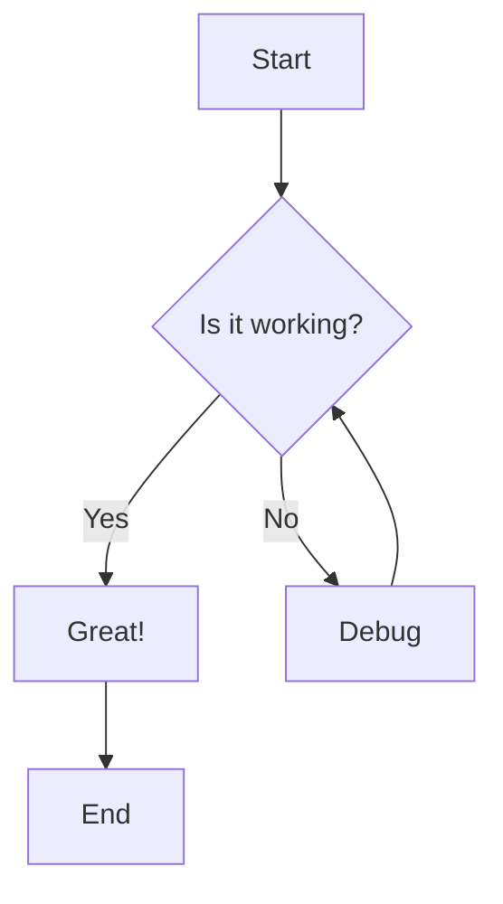
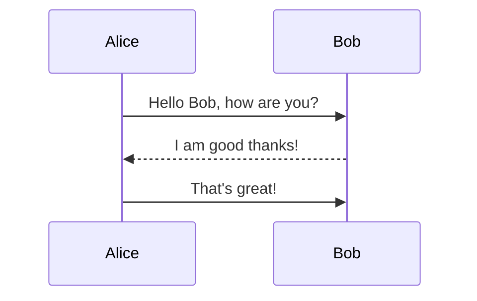
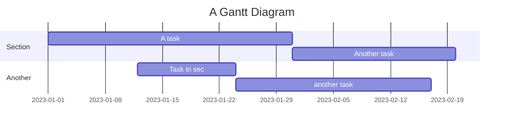

# Getting Started Tutorial

Welcome to the Mermaid to Draw.io converter! This tutorial will guide you through your first conversion and introduce you to the basic features.

## Prerequisites

Before we begin, make sure you have:
- Node.js installed (version 16 or higher)
- The converter installed globally or locally

```bash
# Check Node.js installation
node --version
npm --version

# Install the converter globally
npm install -g mermaid-to-drawio
```

## Your First Conversion

Let's start with a simple flowchart conversion.

### Step 1: Create a Mermaid Diagram

Create a new file called `first-diagram.mmd` with this content:



This creates a simple flowchart with decision points.

### Step 2: Convert to Draw.io

Run the converter:

```bash
mermaid-to-drawio first-diagram.mmd first-diagram.drawio
```

Or if installed locally:

```bash
node converter.js first-diagram.mmd first-diagram.drawio
```

### Step 3: Open in Draw.io

1. Go to [draw.io](https://app.diagrams.net/) or [diagrams.net](https://diagrams.net)
2. Click "Open Existing Diagram"
3. Select your `first-diagram.drawio` file
4. Your diagram should load and be editable!

## Understanding the Output

The converter creates a Draw.io XML file that contains:
- All diagram elements (shapes, text, connections)
- Proper positioning and styling
- Editable components in Draw.io

## Experimenting Further

Try converting different types of diagrams:

### Sequence Diagram

Create `sequence.mmd`:


Convert it:
```bash
mermaid-to-drawio sequence.mmd sequence.drawio
```

### Gantt Chart

Create `gantt.mmd`:


Convert it:
```bash
mermaid-to-drawio gantt.mmd gantt.drawio
```

## Command Line Options

The converter supports various options:

```bash
# Get help
mermaid-to-drawio --help

# Convert with verbose output
mermaid-to-drawio --verbose input.mmd output.drawio

# Specify output format
mermaid-to-drawio --format drawio input.mmd output.drawio
```

## Troubleshooting

### Common Issues

**"Command not found"**
- Make sure the converter is installed globally
- Try using `npx mermaid-to-drawio` instead

**"Browser launch failed"**
- Install Playwright browsers: `npx playwright install`
- Check your internet connection

**"Conversion timeout"**
- Large diagrams might take longer
- Try simplifying the diagram or increasing timeout

### Getting Help

- Check the [Troubleshooting Guide](../Assets/TROUBLESHOOTING.md)
- View examples in the [Examples Guide](../Assets/EXAMPLES.md)
- Check existing issues on GitHub

## Next Steps

Now that you know the basics, try these tutorials:

1. [Advanced Flowcharts](advanced-flowcharts.md) - Complex flowchart techniques
2. [Custom Themes](custom-themes.md) - Styling your diagrams
3. [Batch Processing](batch-processing.md) - Converting multiple files
4. [Web Integration](web-integration.md) - Using in web applications

## Practice Exercises

1. Create a flowchart for your daily morning routine
2. Design a sequence diagram for ordering food at a restaurant
3. Make a Gantt chart for planning a small project

Remember: The best way to learn is by doing! Experiment with different diagram types and see what you can create.
